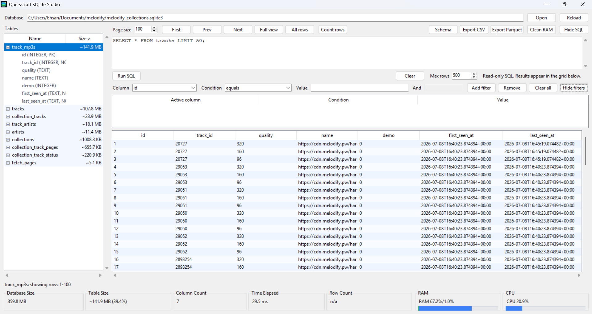
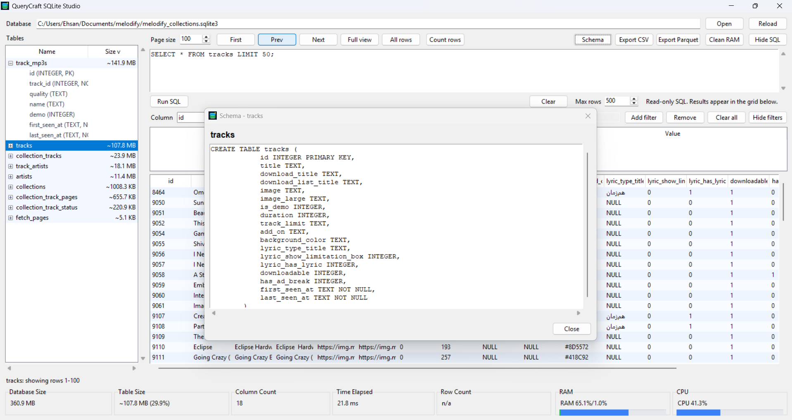

<p align="center">
  
</p>

<p align="center">
  <a href="https://www.python.org/"></a>
  <a href="https://sqlite.org/"></a>
  <a href="https://pandas.pydata.org/"></a>
  
</p>

# QueryCraft SQLite Studio

QueryCraft is a modern desktop SQLite viewer built for large database files. It avoids loading everything at startup, keeps table browsing lazy, and gives you practical tools for inspecting, filtering, editing, exporting, and profiling SQLite data without turning your RAM into confetti.

It starts with no hardcoded database path. Open any `.sqlite`, `.sqlite3`, `.db`, or `.db3` file from the toolbar.

## Screenshots





## Highlights

- Lazy table loading with paginated rows, so heavy databases open without pulling every row into memory.
- Expandable table tree with table sizes, column names, SQLite types, primary-key markers, and not-null markers.
- Clickable column headers for ascending and descending sort.
- Type-aware multi-filter builder with operators like contains, starts with, greater than, between, is null, and is empty.
- Collapsible SQL runner for read-only custom queries, with elapsed query timing and max-row protection.
- Centered schema modal for the selected table.
- Double-click cell editing for primary-key-backed tables.
- Full view toggle that auto-fits visible columns to the longest displayed values.
- Optional All rows mode with a confirmation warning for very large tables.
- CSV and Parquet export for the currently displayed result set.
- Footer analytics for database size, table size, column count, elapsed time, row count, RAM, and total CPU.
- Clean RAM action that restarts the app around the current database to release Python/Tk memory back to the OS.

## Install

Clone the repository, then install the app dependencies:

```powershell
python -m pip install -r requirements.txt
```

The requirements include:

- `pandas` for DataFrame-based export.
- `pyarrow` for Parquet writing.
- `psutil` for RAM and CPU resource meters.

## Run

```powershell
python sqlite_lazy_viewer.py
```

Then click **Open** and choose your SQLite database.

## Export Notes

`Export CSV` writes the visible grid to a CSV file.

`Export Parquet` writes the visible grid to a `.parquet` file through `pandas` and `pyarrow`. Install with `requirements.txt` before using Parquet export on a fresh machine.

## Performance Model

QueryCraft uses a single background SQLite worker for database reads, keeps UI rows display-safe, caches row counts after you request them, and debounces table switching so rapid navigation does not queue a pile of expensive loads.

For extremely large result sets, prefer paginated browsing, filters, or SQL limits. The **All rows** button is available when you really need it, but it can still be expensive because Tk must render every visible row in the grid.

## Project Layout

```text
.
|-- sqlite_lazy_viewer.py
|-- requirements.txt
|-- README.md
`-- docs/
    `-- images/
        |-- querycraft-banner.png
        |-- querycraft-main.png
        `-- querycraft-schema.png
```

## Roadmap Ideas

- Dark/light theme toggle.
- Streaming raw exports directly from SQL.
- ER/UML relationship diagram from foreign keys.
- Saved SQL snippets and saved filter presets.
- Query history with timing and row counts.
